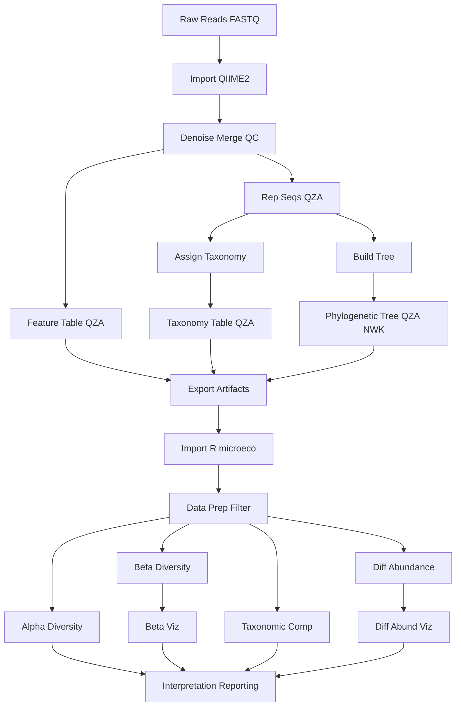

```mermaid
graph TD
    A[Raw Reads FASTQ] --> B[Import QIIME2];
    B --> C[Denoise Merge QC];

    C --> D[Feature Table QZA];
    C --> E[Rep Seqs QZA];
    E --> F[Assign Taxonomy];
    F --> G[Taxonomy Table QZA];
    E --> H[Build Tree];
    H --> I[Phylogenetic Tree QZA NWK];

    J[Export Artifacts];
    D --> J;
    G --> J;
    I --> J;

    J --> K[Import R microeco];

    K --> L[Data Prep Filter];
    L --> M[Alpha Diversity];
    L --> N[Beta Diversity];
    N --> O[Beta Viz];
    L --> P[Taxonomic Comp];
    L --> Q[Diff Abundance];
    Q --> R[Diff Abund Viz];

    S[Interpretation Reporting];

    M --> S;
    O --> S;
    P --> S;
    R --> S;
```
