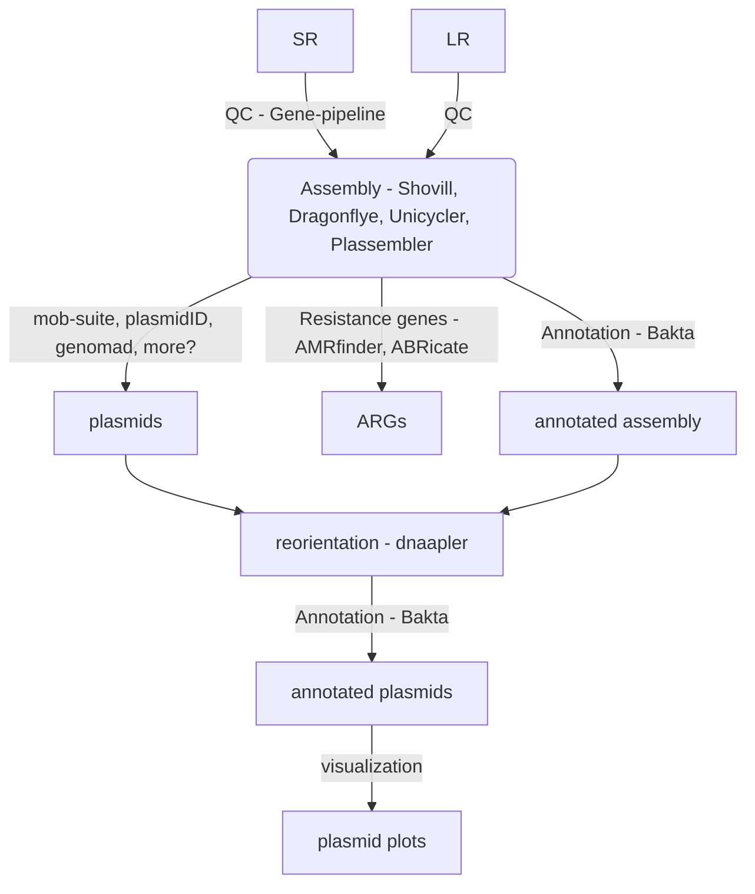

```mermaid
flowchart TD
    A[SR] -->|QC - Gene-pipeline| C(Assembly)
    B[LR] -->| QC | C(Assembly - Shovill, Dragonflye, Unicycler, Plassembler)
    C -->|mob-suite, plasmidID, genomad, more?| D[plasmids]
    C -->|Resistance genes - AMRfinder, ABRicate| E[ARGs]
    C -->|Annotation - Bakta| F[annotated assembly]
    D --> G[reorientation - dnaapler]
    G --> |Annotation - Bakta| H[annotated plasmids]
    H --> |visualization| I[plasmid plots]
    F --> G
```
